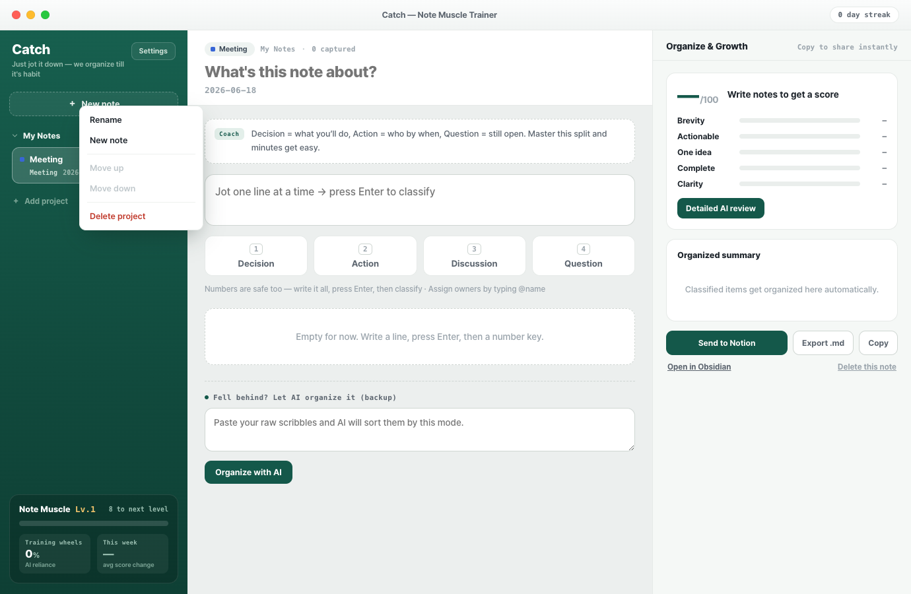

# 캐치 (Catch) — Note Muscle Trainer

A cross-platform desktop app (Windows · macOS · Linux) that trains your
note-taking habit. You jot lines as they come, classify them with a number key,
and Catch scores the result and tracks your growth — gradually weaning you off
AI so the organizing becomes *your* muscle, not the model's.

Built from the Claude Design mock as a real, working Electron application:
the UI is a faithful port of the design, backed by real persistence, real AI
provider integrations, and real exports.



---

## Features

- **Capture → classify** — type a line, press <kbd>Enter</kbd> to stage it, then
  <kbd>1</kbd>–<kbd>4</kbd> (or a button) to file it into the mode's categories.
- **Four note modes** — Meeting, Brainstorm, Task-switch, Daily wrap-up — each
  with its own categories and coaching. Click the mode chip to cycle modes.
- **Owner detection** — type `@name` and Catch extracts the owner automatically.
- **Live scoring** — every note is scored 0–100 across Brevity, Actionability,
  One-idea, Completeness, and Clarity. Language-agnostic, fully local.
- **Score trend** — per-mode score history drawn as a sparkline.
- **Note Muscle** — level, AI-reliance %, and weekly change track your progress.
- **AI organize (backup)** — paste raw scribbles and a real LLM sorts them into
  this mode's categories.
- **AI review** — get specific, encouraging feedback plus a one-line rewrite.
- **Exports** — Markdown file, clipboard, Obsidian (`obsidian://`), and Notion.
- **i18n** — Korean / English, switchable in Settings.
- **Local-first** — notes live in a JSON file in your user-data dir; API keys
  are encrypted at rest with the OS keychain (Electron `safeStorage`).

## AI providers

Pick one in **Settings → AI Provider**, paste an API key, and (optionally)
override the model. Most providers are OpenAI-compatible, so the list is easy to
extend — and a **Custom** option lets you point Catch at any OpenAI-compatible
endpoint by entering your own base URL + model.

| Provider | Key | Default base URL | Default model |
|---|---|---|---|
| Anthropic Claude | ✓ | `api.anthropic.com` | `claude-haiku-4-5` |
| OpenAI | ✓ | `api.openai.com/v1` | `gpt-4o-mini` |
| OpenRouter | ✓ | `openrouter.ai/api/v1` | `openai/gpt-4o-mini` |
| Google Gemini | ✓ | (native) | `gemini-1.5-flash` |
| Z.ai (GLM) | ✓ | `api.z.ai/api/paas/v4` | `glm-4.6` |
| DeepSeek | ✓ | `api.deepseek.com` | `deepseek-chat` |
| Groq | ✓ | `api.groq.com/openai/v1` | `llama-3.3-70b-versatile` |
| Mistral | ✓ | `api.mistral.ai/v1` | `mistral-small-latest` |
| xAI Grok | ✓ | `api.x.ai/v1` | `grok-2-latest` |
| Together AI | ✓ | `api.together.xyz/v1` | `meta-llama/Llama-3.3-70B-Instruct-Turbo` |
| Azure OpenAI | ✓ | env-configured | (deployment) |
| Ollama (local) | — | `127.0.0.1:11434/v1` | `llama3.1` |
| Custom (OpenAI-compatible) | optional | **you provide** | **you provide** |

- Every provider has an editable **Model** field (blank = default).
- **Ollama** and **Custom** also expose an editable **Base URL** field.
- The registry lives in [`src/shared/providers.ts`](src/shared/providers.ts) —
  adding another OpenAI-compatible provider is one entry.
- **Azure** still reads its endpoint/deployment from env vars (see
  [`.env.example`](.env.example)).

API keys are **never** stored in `.env`; you enter them in the app and they are
encrypted at rest via the OS keychain (`safeStorage`).

## Requirements

- **Node 22** (pinned in [`.nvmrc`](.nvmrc); `nvm use` to switch).

## Development

```bash
nvm use            # Node 22
npm install
npm run dev        # launch with hot reload
```

Other scripts:

```bash
npm test           # unit tests (scoring, prompts, markdown)
npm run typecheck  # tsc across main / preload / renderer
npm run lint       # eslint
npm run build      # typecheck + production bundle into out/
```

A headless self-check (verifies the preload bridge + that the UI mounts, and
writes `smoke-capture.png`):

```bash
npm run build && CATCH_SMOKE=1 npx electron ./out/main/index.js
```

## Packaging

Produces installers under `release/<version>/` via electron-builder:

```bash
npm run dist:mac     # .dmg + .zip
npm run dist:win     # NSIS installer
npm run dist:linux   # AppImage + .deb
npm run pack:dir     # unpacked app (no installer) — fast sanity check
```

> Add platform icons under `build/` (`icon.icns`, `icon.ico`, `icon.png`) for
> branded installers; electron-builder falls back to defaults without them.

## Export integrations

Configured in **Settings → Export integrations** (no env files needed):

- **Notion** — paste an internal integration token (stored encrypted, like API
  keys) and a parent page ID (a page you've shared with the integration). "Send
  to Notion" then creates a page with your note's contents.
- **Obsidian** — optionally set a vault name; otherwise the system default vault
  is used. "Open in Obsidian" creates the note via the `obsidian://` URI.

Both still accept env-var fallbacks for headless/automated runs
(`CATCH_NOTION_TOKEN`, `CATCH_NOTION_PARENT_PAGE_ID`, `CATCH_OBSIDIAN_VAULT`) —
see [`.env.example`](.env.example).

## Architecture

```
src/
├── shared/         # domain types + IPC channel names (used by all 3 layers)
├── main/           # Electron main process
│   ├── store.ts    # JSON persistence + safeStorage-encrypted API keys
│   ├── ai/         # provider-agnostic LLM calls, prompts, organize/eval
│   └── exports.ts  # markdown file / clipboard / Obsidian / Notion
├── preload/        # contextBridge → window.catch (typed CatchApi)
└── renderer/       # React UI (faithful port of the Claude Design mock)
    └── src/
        ├── lib/    # constants, i18n, scoring, seed, markdown (pure + tested)
        ├── state/  # useApp() — state, mutations, derived view-model
        └── components/
```

Security posture: `contextIsolation` on, `nodeIntegration` off, a strict CSP,
and a no-op window-open handler that routes external links to the OS browser.

## License

[Functional Source License, Version 1.1, ALv2 Future License (FSL-1.1-ALv2)](LICENSE).

Catch is source-available: you may use, copy, modify, and redistribute it for any
**Permitted Purpose** (internal use, non-commercial education/research, and
professional services) — anything except a **Competing Use** (offering it as a
substitute for, or substantially similar product/service to, Catch). Two years
after each version's release, that version automatically becomes available under
the **Apache License 2.0**. See [`LICENSE`](LICENSE) for the full terms.
